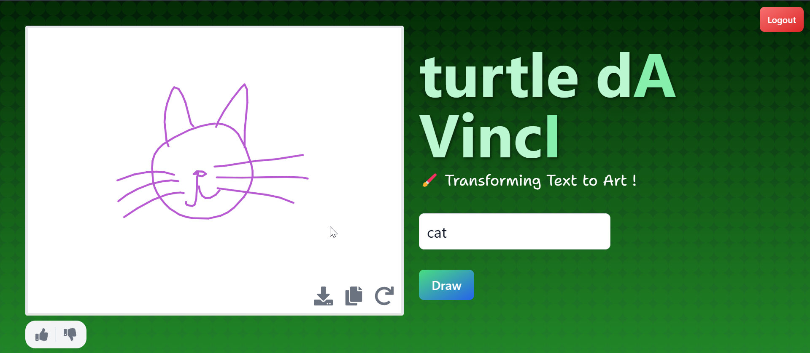
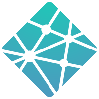
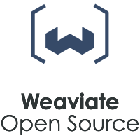

<h1 align="center" style="font-size: 3rem; color: #86efac;">
  turtle da Vinci
</h1>

<h4 align="center">
  <a href="https://text-to-doodle-fe.netlify.app/">turtle Da Vinci App</a> |
  <a href="https://doi.org/gtrstx">Research Paper</a>
</h4>

  <h2>
    A hybrid agent that can draw doodles stroke by stroke.
  </h2>

  <figure>
    
    <figcaption>
      

        Play with the turtle to create funky doodles!
      

    </figcaption>
  </figure>

**turtle da Vinci** is a project that uses the Google Quick Draw dataset to train a model that can generate doodles from text. The model uses pretrained Magenta models from the Google Brain [Magenta project](https://github.com/magenta/magenta). The project is built using React, Vite and Express.

The name **turtle da Vinci** is inspired by turtle graphics and the famous artist Leonardo da Vinci.

The project was built as part of the **Computer Engineering** bachelor's program at the University of Mumbai.

  
Table of Contents

- [Features](#features)
- [Tech Stack](#tech-stack)
  - [Frontend](#frontend)
  - [Backend](#backend)
- [License](#license)
- [Contributing](#contributing)
- [Contributors](#contributors)
- [Attributions](#attributions)

---

## Features

The turtle da Vinci agent:

- 💯&nbsp;Is free and Open-source.
- 🖌️&nbsp;Can draw doodles from simple text prompts.
- 🎨&nbsp;Uses multiple colors.
- ✍️&nbsp;Has a Hand-drawn like style.
- 🔠&nbsp;Supports English.
- 🖼️&nbsp;Exports to PNG.
- ⚒️&nbsp;Asks the user to demonstrate how they would draw the doodle.
- 🔁&nbsp;Can Redo the drawing.

## Tech Stack

This repository is structured as a monorepo with the following packages:

- `client`: The frontend of the application built using React and Vite.
- `server`: The backend of the application built using Express.

The project uses the following technologies:

### Frontend

- [React](https://reactjs.org/): A JavaScript library for building user interfaces.
- [Vite](https://vitejs.dev/): A build tool that aims to provide a faster and leaner development experience for modern web projects.
- [Tailwind CSS](https://tailwindcss.com/): A utility-first CSS framework for building custom designs.
- [appwrite](https://appwrite.io/): An open-source backend server that helps you build modern applications much faster. This project uses Appwrite for image storage.
- [obscenity](https://www.npmjs.com/package/obscenity): A library to detect and filter out obscene words using pattern matching and transformers.
- [react-icons](https://react-icons.github.io/react-icons/): A collection of icons for popular icon libraries like Font Awesome, Material Design, etc.
- [axios](https://axios-http.com/): A promise-based HTTP client for the browser and Node.js.

### Backend

The backend is a collection of multiple services that work together to provide the functionality of the application. The services are:

## License

This project is licensed under the MIT License. See the [LICENSE](./LICENSE) file for more information.

## Contributing

Contributions are welcome! Feel free to open an issue or submit a pull request if you have any suggestions or improvements to the project. Check out the [CONTRIBUTING.md](./CONTRIBUTING.md) file for more information.

## Contributors

|  |  |  |  |
| :-------------------------------------------------------------------------------: | :--------------------------------------------------------------------------------: | :-------------------------------------------------------------------------------: | :------------------------------------------------------------------------------: |
|                 [Vishal Shinde](https://github.com/vishal-codes)                  |                 [Manas Telavane](https://github.com/manastelavane)                 |                [Bhargav Modak](https://github.com/TheBrahmnicBoy)                 |             [Shantanu Parameswaran](https://github.com/shantanup06)              |

## Attributions

The project uses the following assets:
- The background image is from [https://bgjar.com/](https://bgjar.com/).
- The icons are from [react-icons](https://react-icons.github.io/react-icons/).

Named after the famous artist Leonardo da Vinci, the project is a tribute to his work and his contributions to the world of art and science.

We're thankful to these companies for offering their services for free:

  